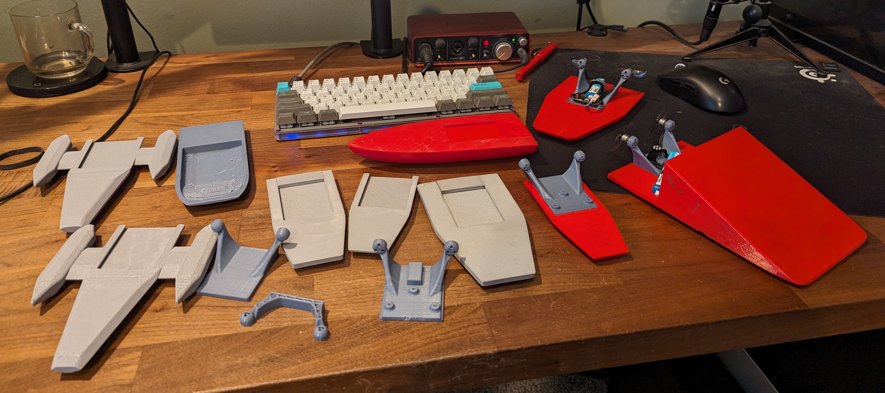

Airboat
=======
<p align="center">
  
</p>
This project is an agile and speedy airboat designed with spare parts that I had laying around.  
Like most FPV pilots, I have a handfull of spare or broken parts laying around and I wanted to use on a watercraft design.
After countless testing and hull re-designing I finally landed on what I think is a good balanced hull design.
The hull is able to be taken up to full throttle and fully turned without capsizing or upsetting the hull too much.

This project is also posted to [thingiverse](https://www.thingiverse.com/thing:6541742 "thingiverse link")
  

Parts list:
===========
Here is the list of parts I used to create the airboat, but many other tinywhoop parts will work as well.

- Flight Controller: Happymodel Diamond F4 ELRS
- Motors: 2x newbeedrone 0703 16420kv
- Props: Gemfan 1610 biblade
- Battery: Betafpv 300mah bt2.0
- bit of velcro for battery strap
- conformal coating


How to print:
=============
This project is broken into 3 printable parts, You will need to print one of each of these pieces to complete your airboat.
I printed most of the hulls and the carrier in PLA with great success.  
I also tried out lightweight PLA on a couple hulls which ended up absorbing water, so I recommend other materials unless you want to coat it after printing.

### Hull


- This is the hull of the boat without any electronics or additional features  
- print upside down with supports touching buildplate)
- [airboat_neo_hull.stl](airboat_design/airboat_neo_hull.stl) can be found in the `airboat_design/` directory
---
### Carrier


- This is the model where all of the electronics are mounted, this can be moved to different hull designs  
- print flat side down with no supports 
- [carrier.stl](airboat_design/carrier.stl) can be found in the `airboat_design/` directory
---
### Carrier Plug


- This is a plug that fits in behind the carrier  
- it helps push the carrier forward to balance the weight on the hull and fills the gap behind the carrier
- Print large sizde down with no supports 
- [airboat_carrier_plug.stl](airboat_design/airboat_carrier_plug.stl) can be found in the `airboat_design/` directory


Programming FC:
===============
If you decided to use an old flight controller like I did, you'll need to configure it in betaflight to work as an airboat.
I have uploaded my [CLI dump](cli_dump/BF_airboat_diamondf4_dump.txt) if anyone is using a diamond f4, otherwise you'll need to do a few different configurations.

- Motor Resource allocation: You need to only enable the 2 motors that are being used.
  ```
  resource MOTOR 1 B07
  resource MOTOR 2 B10
  resource MOTOR 3 NONE
  resource MOTOR 4 NONE
  
  save
  ```

- Custom Motor Mixes: this will allow us to use a custom motor mix allowing us to turn using differential thrust
  ```
  mixer custom
  mmix reset
  mmix 0  1.000  0.000  0.000 -1.000
  mmix 1  1.000  0.000  0.000  1.000
  
  save
  ```

- Disable Profile Independant Filter Settings: We can disable much of the filtering since we aren't a quadcopter anymore.  
  - Disable `Gyro Lowpass Filters`, `Gyro Notch Filters`, and `Dynamic Notch Filter`  
  - [Reference photo](photos/airboat_bf_filters.png)

- Disable Runaway Prevention: On one of my boats, runaway prevention stopped me from hitting full power on the airboat, so I ended up disabling it
  ```
  set runaway_takeoff_prevention = OFF
  
  save
  ```

- Disable VTX: We need to disable the built in VTX if our FC has one so we dont cook the board. This can usually be accomplished by bridging a solder pad or disabling in software.  
  I have disabled the VTX in the `Configuration` -> `Other Features` tab in betaflight.


Extras:
=======
I've done extensive testing of different hulls, some of which lead to stranded vessels.
To recover vessels I'm testing out a floating recovery rope (floating fly fishing line) that I can pull behind one of the boat and "drive" the recovery boat+line around the stranded vessel to bring it home.
I have added the following miscellaneous parts to the project:


### Carrier Utility Plug


- The carrier plug can be swapped out with this Carrier Utility Plug to add a loop to the back of the airboat.
- [airboat_utility_plug.stl](airboat_design/airboat_utility_plug.stl) can be found in the `airboat_design/` directory
- print with no supports
---

I tested numerous hull designs looking for the most balanced. I even made a ramp boat so I can drive it out to the middle of the pond and ramp my other airboat. Turns out it had a tendency to capsize..
Here are some of my prototypes:


If you've come this far, thanks for checking out my project, if you have any interest in the source files or to see all of my legacy designs, check out the project over on [onshape](https://cad.onshape.com/documents/6728372e51ea95be38f71059/w/a7f577bf32b5131d55028480/e/84ca7f1b91ac43509baaff38)


[](https://youtu.be/J2SFbNkRmbY)  
[](https://youtu.be/VxDwH-HvI94)
